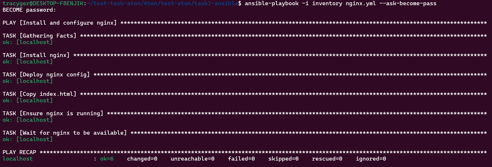

# Task 1 — Ansible: Установка и настройка NGINX

## Описание
Сценарий Ansible устанавливает `nginx`, настраивает конфигурацию, копирует `index.html` и проверяет доступность порта.

## Структура
```
task1-ansible/
├── nginx.yml
├── inventory
├── templates/
│   └── nginx.conf.j2
├── files/
│   └── index.html
```

## Команда для запуска
```bash
ansible-playbook -i inventory nginx.yml --ask-become-pass
```

## Скриншот результата выполнения
