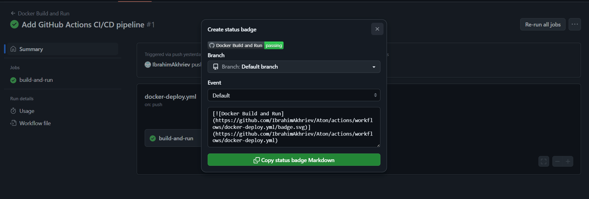

# Task 4 — CI/CD: GitHub Actions для NGINX

## Описание
Сборка Docker-образа и запуск HTTPS-сервера через GitHub Actions.

## Структура
```
task4-ci-cd/
├── Dockerfile
├── docker-compose.yml
├── nginx/
│   ├── nginx.conf
│   ├── cert.crt
│   └── cert.key
├── html/
│   └── index.html
└── .github/workflows/
    └── deploy.yml
```

## Скриншот GitHub Actions
